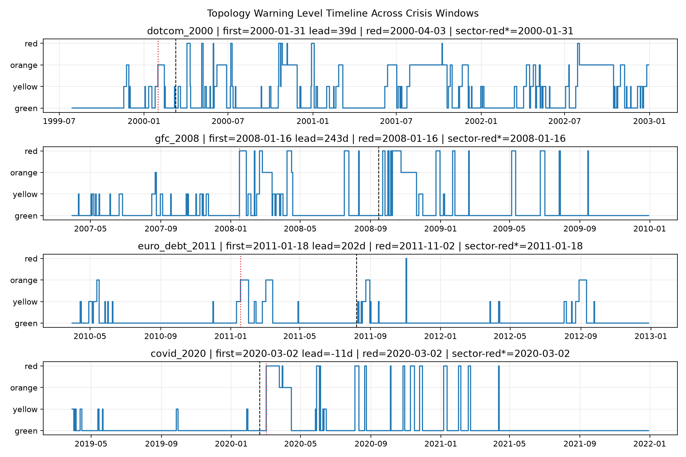

# Economic Topology Warning MVP

**一句话定位：这个框架不预测价格涨跌，而是检测高维资产收益状态空间是否发生“拓扑分裂/断裂”，用于研究金融危机前后的市场结构变化。**

当前版本是一个可运行的 research prototype：它把多只股票的滚动收益窗口看成高维点云，用一阶 Vietoris-Rips 图近似估计 `beta0`、`beta1` 和 `S_topo`，再用趋势分支、断裂分支、预警周期重置机制输出 `green/yellow/orange/red` 信号。

## 它做什么、不做什么

做：

- 检测市场结构是否从“连通状态”走向“分裂状态”。
- 比较拓扑信号与传统对照指标，例如平均相关性 `avg_corr`、平均波动率 `avg_vol`。
- 在 2000、2008、2020 三类危机窗口上做探索性回测。
- 输出可解释字段：`beta0`、`beta1`、`S_topo`、`fracture`、`cycle_status`、`avg_phase`、`phase_sync`、`topo_potential`、缺陷节点、风险链路、行业确认结果。

不做：

- 不预测明天涨跌。
- 不直接给交易建议。
- 不声称已经可以部署到真实风控系统。
- 不声称当前 proxy 等价于完整 persistent homology。

## 核心思想

传统风险指标通常在市场共振后才变强：

```text
相关性升高 -> 大家一起跌
波动率升高 -> 危机已经显性化
```

拓扑预警尝试观察更早的结构变化：

```text
市场状态点云开始分裂
局部连通性改变
beta0 上升
S_topo 下降
```

换句话说，它研究的是：

```text
市场是不是先“裂开”，然后才“一起崩”。
```

## 当前 MVP 做什么

- 输入滚动窗口经济指标或股票成分股收益率。
- 对窗口内状态点做 z-score 标准化。
- 构建 Vietoris-Rips 1-skeleton 近似图。
- 估计：
  - `beta0`：连通分支数，代表状态空间是否分裂成多个岛屿。
  - `beta1`：图循环秩，作为反馈回路 proxy。
  - `S_topo`：拓扑稳定性 proxy。
- 输出四色预警：`green / yellow / orange / red`。
- 输出 top drivers，帮助追溯哪些股票/指标推动结构变化。

## 重要边界

当前版本是标准库 MVP，不是完整 persistent homology：

- `beta0` 和 `beta1` 基于一阶图近似。
- `S_topo` 是工程 proxy。
- 当前股票池是探索性代表样本：美国窗口使用 16 只 S&P 500 代表股，欧洲窗口使用 17 只欧洲 ADR/国际大盘股 proxy，存在样本不足和幸存者偏差。
- 阈值来自探索性调参，尚未完成 out-of-sample 验证。
- 后续可以把内部后端替换为 `ripser` 或 `gudhi`，外层接口保持不变。

## 多危机结果一图

运行多危机回测后会生成：

```text
data/multi_crisis/multi_crisis_level_timeline.png
```

该图展示 2000、2008、2011 欧债、2020 四个窗口的 `final_level` 随时间变化，并标注危机节点。



## 回测结果摘要

当前 P0/P1/P2 + 跨市场验证结果。`行业红色候选*` 是实验字段：当市场进入有效预警周期，且预警附近至少 2 个 proxy sector 同步确认时，给出一个 sector-escalated red candidate；它不改写主 `final_level`。

| 窗口 | 首次有效周期预警 | lead | 首次红色 | red lead | 行业红色候选* | candidate lead | 行业确认 | 一致性 |
|------|------------------|------|----------|----------|----------------|----------------|----------|--------|
| 2000 dotcom | 2000-01-31 | 39d | 2000-04-03 | -24d | 2000-01-31 | 39d | warn: consumer_defensive + industrial_health; red: financials | warn 2/4; red 1/4 |
| 2008 GFC | 2008-01-16 | 243d | 2008-01-16 | 243d | 2008-01-16 | 243d | warn/red: financials + technology | warn 2/4; red 2/4 |
| 2011 euro debt | 2011-01-18 | 202d | 2011-11-02 | -86d | 2011-01-18 | 202d | warn: europe_technology + europe_defensive; red: europe_financials | warn 2/4; red 1/4 |
| 2020 COVID | 2020-03-02 | -11d | 2020-03-02 | -11d | 2020-03-02 | -11d | broad: all four proxy sectors | warn 4/4; red 4/4 |

解释：

- 2000：慢变泡沫破裂，趋势分支给出约 39 天有效提前预警。
- 2008：结构性金融危机，拓扑信号很早进入红色，但仍存在预警过早问题。
- 2011：欧债窗口也出现提前趋势信号，说明框架不只依赖美国市场样本；红色阶段由欧洲金融组确认，但红色本身滞后。
- 2020：COVID 是外生冲击，无法在冲击前预警，但断裂分支能在冲击后较快确认，且行业一致性达到 4/4。

## 预警机制

多危机脚本使用三层机制：

1. 趋势分支：综合 `beta0_z` 与 `S_topo` 下行形成趋势评分。
2. 断裂分支：检测 5 个交易日内 `beta0` 累计跳变，并用 `avg_vol` 激增确认。
3. 周期重置：短促、弱、很快恢复的预警周期会被取消，避免信号疲劳。
4. 行业确认：在市场级首次预警/红色信号前后 30 天内，检查哪些 proxy sector 同步处于 active orange/red 状态。
5. 相位动力学诊断：基于滚动窗口回撤映射节点风险相位，计算 `phase_sync`、`topo_potential`、`top_defect_nodes` 与 `top_risk_links`，用于定位风险同步、核心缺陷节点和潜在传导链路。
6. 行业一致性实验：当市场有效预警附近至少 2 个行业同步确认时，输出 `sector_escalated_red_candidate`，并在总图中用红色虚线标注；该字段只用于研究对照，不改写主预警级别。

## 2026/2027 拓扑风险前瞻

本项目除了历史危机回测，也包含一个前瞻性监控入口：`scripts/live_forecast.py`。它会抓取最近约两年的代表性美股数据，把当前市场状态映射到滚动收益点云，并输出当前拓扑结构的风险快照。

需要强调：这里的“2026/2027 前瞻”不是价格预测，也不是交易建议，而是对未来一到两年可能出现的市场结构脆弱性进行拓扑诊断。它关注的问题是：

```text
2026/2027 附近，市场状态空间是否正在从连通、可恢复状态，转向分裂、同步、脆弱状态？
```

### 前瞻评分使用的信号

`forecast_from_record` 会综合以下结构性信号：

- `beta0_z`：连通分支是否异常上升，代表状态空间碎片化增强。
- `s_z`：`S_topo` 是否走弱，代表拓扑稳定性下降。
- `phase_sync`：风险相位是否趋于同步，代表资产群体可能进入共振状态。
- `sector_warn_count`：行业层面是否出现同步确认。
- `cycle_status` / `final_level`：当前是否已经处于有效预警周期。

输出字段包括：

```text
forecast_score, forecast_level, confidence, reason
```

其中 `forecast_level` 分为：

```text
low -> watch -> elevated -> high
```

### 2026/2027 的解释框架

对外表达时可以这样讲：

> 2026/2027 前瞻模块不是判断指数会涨还是跌，而是持续检查市场高维收益状态空间是否出现拓扑分裂、稳定性下降、行业同步确认与风险相位共振。如果这些结构性信号同时增强，系统会把未来窗口的结构风险从 `low` 提升到 `watch/elevated/high`。

可以把 2026/2027 风险分成三类情景：

| 情景 | 拓扑状态 | 解释 |
|------|----------|------|
| 基准情景 | `forecast_level = low` | 市场点云仍保持较好连通性，拓扑稳定性没有明显恶化。 |
| 观察情景 | `forecast_level = watch` | 出现轻微碎片化或相位同步，需要持续监控，但尚不足以形成强预警。 |
| 脆弱情景 | `forecast_level = elevated/high` | `beta0` 异常、`S_topo` 走弱、相位同步和行业确认同时出现，说明市场结构可能进入危机前的脆弱区。 |

### 运行 2026/2027 前瞻脚本

```bash
python scripts/live_forecast.py
```

脚本会输出：

```text
最新日期
当前 beta0 / beta1 / S_topo
当前 green/yellow/orange/red 拓扑预警级别
phase_sync / topo_potential
forecast_score / forecast_level / confidence / reason
最近60天窗口最佳前瞻
近60天 orange/red 统计
综合风险前瞻判断
```

建议上传 GitHub 后，把每次运行得到的关键前瞻结果记录到 issue、release note 或后续的 `FORECAST_LOG.md` 中，避免 README 固化成一次性的市场判断。

## 运行 demo

```bash
python demo.py
```

## 运行测试

```bash
python tests/test_analyzer.py
```

## 运行 2007-2009 S&P 500 代表成分股回测

脚本会从 Yahoo Chart 接口抓取 16 个代表性成分股的日线复权收盘价，计算日收益率后做 60 日滚动窗口拓扑分析，并输出普通对照指标：平均相关性 `avg_corr` 与平均波动率 `avg_vol`。如果本机安装了 `matplotlib`，会额外生成 PNG 图表。

```bash
python scripts/sp500_2008_backtest.py
```

输出文件：

```text
data/sp500_representative_topology_2007_2009.csv
data/sp500_representative_topology_2007_2009.png
```

## 运行多危机窗口回测

```bash
python scripts/multi_crisis_backtest.py
```

仓库保留的精选输出文件：

```text
data/multi_crisis/summary.csv
data/multi_crisis/multi_crisis_level_timeline.png
data/multi_crisis/risk_reports/*_risk_report.txt
```

脚本仍可重新生成详细窗口 CSV、行业 CSV 和行情缓存。为了保持公开仓库干净，这些中间文件已被 `.gitignore` 忽略：

```text
data/multi_crisis/dotcom_2000.csv
data/multi_crisis/gfc_2008.csv
data/multi_crisis/euro_debt_2011.csv
data/multi_crisis/covid_2020.csv
data/multi_crisis/sectors/
data/yahoo_cache/
data/stooq_cache/
```

主窗口与行业窗口 CSV、以及每个危机的风险报告均保留原字段，并新增第一阶段量子潮水诊断字段、结构脆弱性判定字段与轻量调控建议：

```text
avg_phase, phase_sync, topo_potential, top_defect_nodes, top_risk_links
centralization_risk_gini, redundancy_risk, sync_risk, vulnerability_flags
design_suggestions
```

## 适合对外讲的故事线

> 金融危机不一定先表现为所有资产一起暴跌。某些危机中，市场状态空间会先出现拓扑分裂：一些资产群体开始脱钩、状态点云连通性下降、`beta0` 上升。这个框架尝试捕捉这种“结构先裂开”的信号，而不是预测价格本身。

四类窗口对应四种模式：

- 2000：慢变泡沫，趋势信号逐步积累。
- 2008：系统性金融危机，结构异常持续较久且红色信号明显提前。
- 2011：欧债危机，欧洲 proxy 样本出现提前趋势信号，金融组在红色阶段确认。
- 2020：外生冲击，事前难以预警，但断裂分支能快速确认。

## 后续升级建议

1. 扩展到 S&P 100、STOXX Europe 代表股或更完整的历史成分股，减少样本不足和幸存者偏差。
2. 增加更多跨市场窗口，例如亚洲金融危机、欧债危机细分阶段、英国脱欧冲击。
3. 替换 proxy 后端为真实 persistent homology，例如 `ripser`/`gudhi`。
4. 增加对照基准：VIX、VSTOXX、最大回撤、滚动相关性、滚动协方差矩阵特征值。
5. 做 leave-one-crisis-out 验证，降低阈值调参争议。
6. 把行业一致性从解释字段升级为可选红色触发规则，并用 out-of-sample 验证避免过拟合。
